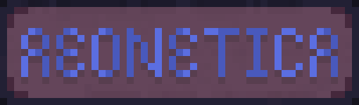
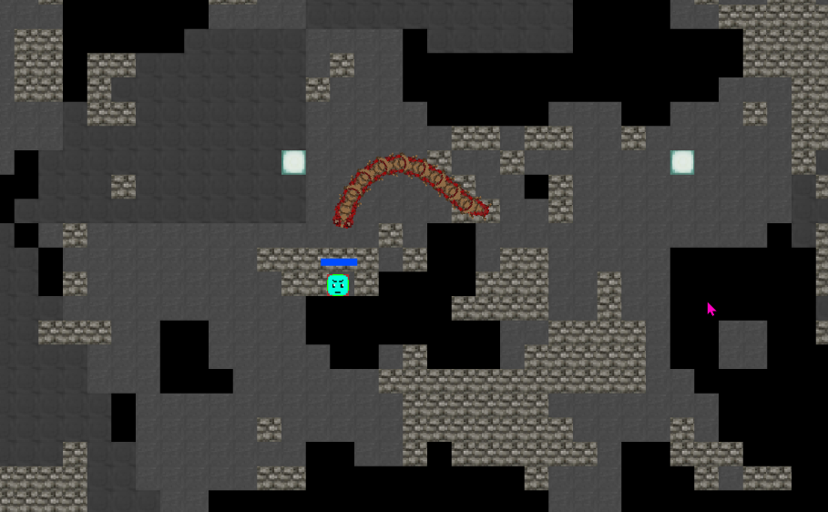

<div align="center">



<h1>The Aeonetica Multiplayer Game Engine</h1>

#### [📑Documentation](https://github.com/DragonFIghter603/aeonetica/wiki) [⚖️License](../LICENSE) [🌿Release Branch](https://github.com/DragonFIghter603/aeonetica/tree/release) [🚀Releases](https://github.com/DragonFIghter603/aeonetica/releases)

</div>

[](https://github.com/DragonFIghter603/aeonetica/blob/main/LICENSE)
[](https://github.com/DragonFIghter603/aeonetica/issues)


[](https://github.com/DragonFIghter603/aeonetica/stargazers)
[](https://github.com/DragonFIghter603/aeonetica/network/members)


---

2D multiplayer moddable game engine with server side ECS 

---



---

## Quickstart

1. Clone the repo and (optionally) go to [release branch](https://github.com/DragonFIghter603/aeonetica/tree/release) for stability
    ```shell
    $ git clone https://github.com/DragonFIghter603/aeonetica.git --recursive
    $ git checkout -b release
    ```
2. Compile the client, server and mods
    ```shell
    $ python3 build.py
    ```
3. Run first the client and then the server in two separate command prompts next to each other
    ```shell
    $ cd server
    $ cargo run -- <server_ip:server_port>
    # example: cargo run -- 127.0.0.1:6090
    # or simply:
    $ python3 build.py -r

    # and
   
    $ cd client
    $ cargo run -- <client_ip:client_port> <server_ip:server_port> 
    # example: cargo run -- 127.0.0.1:9000 127.0.0.1:6090
    # or simply:
    $ python3 build.py -r
    ```
    Alternatively, run the binaries of client/server from `<crate>/target/release/<executable>.exe`. <br>
    Build with `--release` flag `py build.py --release` and `cargo run --rlease` for better performance. <br>
    For multiple clients, use a different `client_port` for each: `9000`, `9001`, ...

## Dependencies

### GNU/Linux:

- rust **nightly** toolchain 1.70 or newer
- python 3.x
- `libglfw3-dev`
- `libxinerama-dev`
- `libxcursor-dev`
- `libxi-dev`

> **Note**
> These packages are named for Debian(-based) systems. Other linux distributions may use other package names.

### Windows:

- rust **nightly** toolchain 1.70 or newer
- python 3.x

> **Note**
> All other dependencies should get fetched by `cargo` automatically.

## Credit/Main Contributors
- [DragonFighter603](https://github.com/DragonFIghter603) - server ecs and networking
- [Spydr06](https://github.com/Spydr06) - client and graphics
- [Tascripp](https://www.instagram.com/tascripp/) some of the art