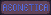

# Aeonetica Engine

2D multiplayer moddable game engine with server side ECS

### [Documentation](docs/README.md)

---

### TODOs:
- [x] ECS
- getting a screen & client side rendering
- [x] clean up client mod loading
- [x] cleanup of error handling
  - [x] client side
  - [x] server side
- [x] utility functions that return the path to a lib (and have platform appropriate ending)
- [ ] checking whether all mods are valid after loading by checking for files and checking which platforms are supported
- [x] better mod build script using probably python, make it platform  generic